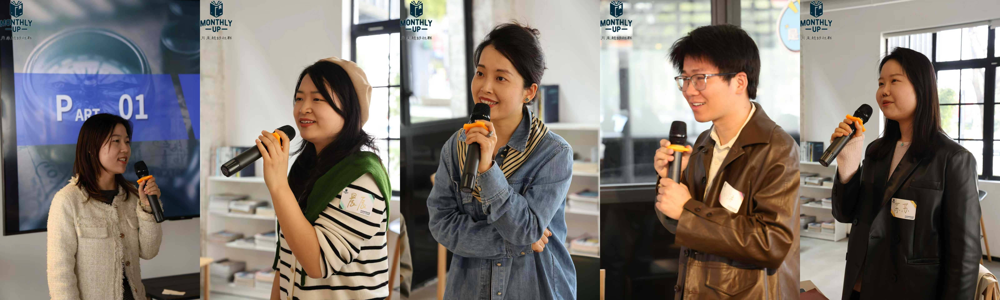
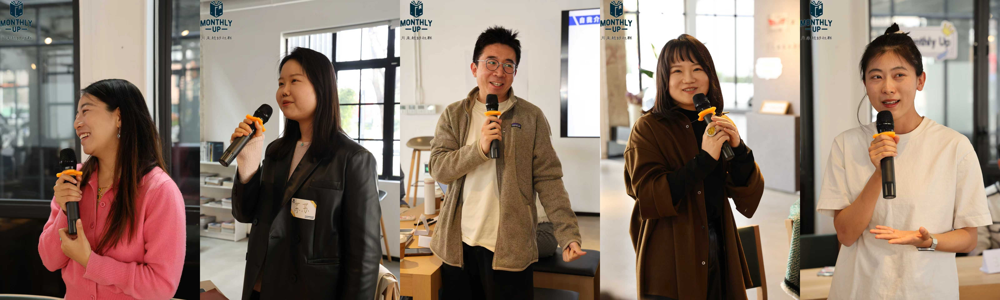
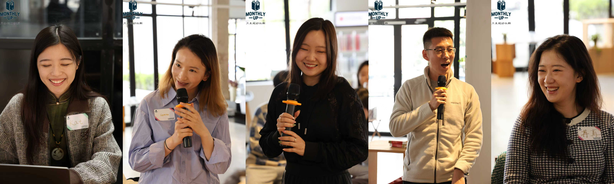
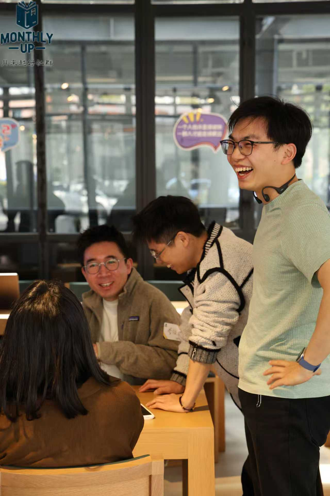
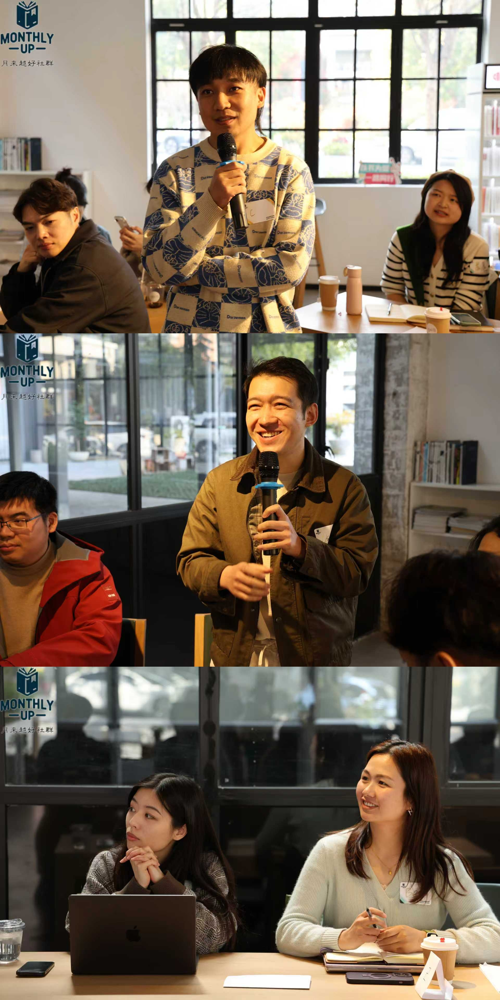
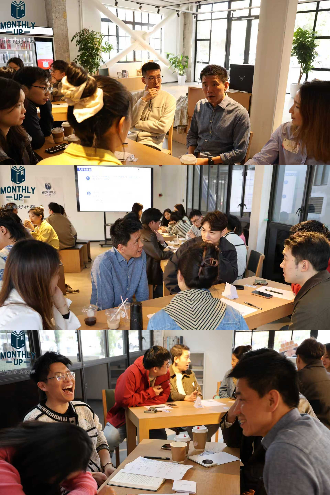

# 《投资最重要的事》：在不确定的世界里，与其追求“赢”，不如先学会“不输”
《投资最重要的事》：在不确定的世界里，与其追求“赢”，不如先学会“不输”

作者: 月来越好MonthlyUp

公众号: 月来越好MonthlyUp

**目录**

01 回望经典，为何我们要读《投资最重要的事》？

02 与其预测胜负，不如做个不退赛的“长跑者”

03 穿透周期的定力：实战价值挖掘与人生节律

04 深度思辨：在互相提问中照见自我

05 小组讨论的精彩时刻

06 致谢与预告

月来越好社群系列活动回顾

悦读系列第 28 期·总第 50 期

在波诡云谲的投资市场中，我们常常被各种收益神话所吸引，却往往忽视了底层逻辑的支撑。**霍华德·马克斯的《投资最重要的事》，被巴菲特评价为“极其罕见的、真正有用的投资书”，也是每一位专业投资人书架上必读的圣经。**

本次悦读分享会，月来越好的小伙伴们聚在一起，结合各自在不同行业大周期中的实战感悟，重新拆解这本经典之作，试图在不确定的世界里，寻找那份穿越周期的定力。

“投资是一辈子的事情，在这个领域，我们每个人都是终身的学习者”。现场的一段开场白，拉开了这场思想碰撞的序幕。

**01 回望经典，为何我们要读《投资最重要的事》？**

■ ■ ■ ■

**在探索投资认知的路上，我们为何选择将这本书作为共学的起点？**

**现场的一位小伙伴分享了他的心路历程：** 其实他接触这本书是在2022年，当时他正深耕的行业经历了前所未有的困难。当市场从高速增长突然进入迷茫期，他问遍了身边的同行，大家同样困惑。那一刻，他重新翻开了这本书。

书中的思想给了他极大的启发。真正能读完且理解透彻的书并不多，而这本书，它不仅是关于投资的技术，更是关于在极端市场环境下如何自处的心法。它让我们明白，在迷茫时，向上帝求助不如向大师的智慧求助。

**02 与其预测胜负，不如做个不退赛的“长跑者”**

■ ■ ■ ■

**在分享中，大家达成了一个最核心的共识：颠覆对“投资预测”的执念，建立概率思维。**

**大家一致认为：**

投资的核心认知是——这个世界本身就是概率的。宏观、微观、甚至个人的感情因素都在时刻影响着结果。预测是不可靠的。我们不能希望通过对未来的预测来做今天的投资。

既然预测不可靠，那我们的目的到底是什么？是**跑完**。

这里涉及到一个概念——**“Loser's Game”（输家的游戏）**。

大家在讨论中提到：马拉松冠军需要天赋、极度科学的训练与资源的堆砌。但在投资的长跑中，绝大多数人并不具备成为“世界冠军”的资源。

我们要培养的不是如何成为“赢家”，而是如何不沦为“输家”。只要确保不因为激进导致半途退出（Stay in the game），你就已经跑赢了99%的人。这种“不退赛”的定力，比任何短期的超额回报都重要，因为它让你学会了在不确定性中与自己握手言和。

**03 穿透周期的定力：实战价值挖掘与人生节律**

■ ■ ■ ■

**投资的逻辑往往通向实战的取舍，最终汇流向人生的哲学。一位有着15年房地产投资经验的小伙伴，分享了他在具体案例中的深度思考。**

**现场提到的两个实战案例引发了大家的共情：**

一是2022年的数据中心投资，即便在科技风向转变时，也基于数字化大周期的认知坚持推进；二是2023年的某地产项目，即便价格低廉，但因缺乏足够的安全边际（Buffer）而断然放弃。

“在下行周期，你绝不能把自己逼到‘必须每一步都如期发生’的死胡同。保持对市场的敬畏，给自己留一点犯错的空间。”

这种定力延伸到生活中，便是对**“节奏”**的把控。大家在交流中提到了一个著名的历史典故：一战时的法军总司令约瑟夫·霞飞。在德军压境、巴黎岌岌可危的溃败边缘，霞飞作为统帅，依然坚持每日一日三餐准时，早晚准时睡觉。因为他深知，如果统帅自己乱了阵脚，整个防线也会崩塌；只有稳定住生活的基准线（Nothing can change），以此对抗外部极致的高压，才能在纷乱中做出最理智的决策。

无论是像“狐狸”一样不断根据事实修正观点，还是在压力下维持跑步与阅读的习惯，本质上都是在修炼一颗 Stay true to yourself 的心。

此处贴以下翻页图

**04 深度思辨：在互相提问中照见自我**

■ ■ ■ ■

**在自由提问环节，大家针对关于自我定位、投资优势及应对危机的困惑进行了深度的碰撞。**

**Q**

**在“做自己”之前，如何先“找到自己”？**

**A**

这需要一个不断试错（Practice）的过程。首先要明确自己“不想要”什么，从而避免被他人带偏。其次要放下自尊，去理解甚至接纳那些比你更正确的观点。你可以通过小仓位不断尝试，在正反馈中一点点建立属于自己的认知内核。

**Q**

**面对 AI 与量化的“降维打击”，个人投资者如何突围？**

**A**

AI 的本质是市场情绪的放大器，它让涨跌更剧烈。要在这种环境中获胜，核心是“逆向思考”——你的情绪必须能与大众情绪区分开。通过深度研究找到市场未察觉的盲点，在别人恐慌时保持定力，这才是 AI 无法模拟的 Alpha。

**Q**

**职场人如何抵抗 Peer Pressure，守住不该出手的线？**

**A**

很多激进的错误决策源于“害怕失去（Fear to lose）” ———— 怕不拿项目就没成绩、没工作。但你要知道，一个错误的决策可能会定义你未来几年的职业生涯。抵抗平庸的压力很难，但坚持专业判断的底气，来自于你接受“即便失去当前，也能再次出发”的心理建设。

**05 小组讨论的精彩时刻**

理论的终点，最终要回归到切身的实践中。在深度提问环节之后，大家进入了最期待的小组讨论环节。

（补一下ppt的图）todo

屏幕上投射出的两个核心议题，直戳每一位投资者的痛点。在接下来的小组讨论中，每个人都放下了防御，分享了那些最真实的、甚至带着“痛感”的实战领悟。

**RanRan**

“投资中最难的不是判断大势，而是与自己的自负和贪婪做斗争。我曾在一个极具潜力的资产上眼睁睁看着它翻倍，却因‘还想赢更多’的贪婪心理错失了退场时机，最终落得血本无归。这让我刻骨铭心地意识到，一定要设定严苛的止盈止损点。在不确定的世界里，学会‘见好就收’比任何精准的预判都更稳健。”

**Agnes**

“不要让平台定义你。身处大机构，最危险的是分不清资源到底是平台的还是你自己的。真正的底气不来自于名片上的头衔，而来自于那套超越平台、可迁移的个人方法论。当你把自己视作一个独立的‘平台’，你就不再恐惧任何外部环境的崩塌。”

**ChenChen**

“面临选择时难免会感到恐惧。关于这一点，我也请教了大家，最后建议我先锁定一个目标，然后试着朝远处看一点。在往前走的过程中，我们可以不断地进行微调，但核心是要始终朝着那个大的目标走。当你学会把视线拉向远方，当下的这些困难甚至恐惧，也就没那么容易干扰到你了。”

**Oscar**

“投资的第一条准则，是永远保护好你的本金。通过资产的分散配置和严格的止损纪律，我们能确保自己始终留在牌桌上。只有先学会‘不输’，在市场转好时，我们才拥有再次大胆下注的底气和资本。”

**Zheng**

“没真拿本金砸进去过的人，永远理解不了那种‘心跳感’。投资不是玩数字游戏，而是在极度贪婪和恐惧的边缘修身养性。”

**06 致谢与预告**

■ ■ ■ ■

正如现场一位小伙伴在复盘时感叹的那样：“投资不仅是认知的变现，更是一场关于真相的博弈——学会放手头脑里的‘期待’，转而拥抱眼前的‘事实’，这就是我们最核心的生存法则。”

最后，要将最诚挚的感谢送给每一位报名参与的小伙伴。正是大家那种对经典的敬畏心与毫无保留的分享，才让这场读书会拥有了最动人的共创力量。此外，还要特别致谢领读人阳哥与健哥。那些制作精良、赏心悦目的领读卡，让经典的价值在视觉与认知的碰撞中，有了更入心的回响。

在这个充满变化的世界里，或许我们无法预测未来，但我们可以通过建立稳健的底层认知，在同路人的陪伴下，在不确定的浪潮中稳住舵盘。

** 【活动预告】↷**

# 月来越好×下一期联名活动报名即将开启！
月来越好×下一期联名活动报名即将开启！

保持关注，敬请期待！

撰稿：月来越好编辑部

摄影：社群伙伴

审核：月来越好编辑部
