# 《投资最重要的事》：在不确定的世界里，与其追求“赢”，不如先学会“不输”

作者: 月来越好MonthlyUp

公众号: 月来越好MonthlyUp

**目录**

01 回望经典，为何我们要读《投资最重要的事》？

02 与其预测胜负，不如做个不退赛的“长跑者”

03 穿透周期的定力：实战价值挖掘与人生节律

04 精华问答：在实战中寻找自我与优势

05 小组讨论的精彩时刻

06 致谢与预告

月来越好社群系列活动回顾

悦读系列第 28 期·总第 50 期

在波诡云谲的投资市场中，我们常常被各种收益神话所吸引，却往往忽视了底层逻辑的支撑。

**霍华德·马克斯的《投资最重要的事》，被巴菲特评价为“极其罕见的、真正有用的投资书”，也是每一位专业投资人书架上必读的圣经。** 本次悦读分享会，我们还邀请到了一位深耕投资行业的神秘嘉宾，带我们重新拆解这本经典之作，寻找穿越周期的定力。

“投资是一辈子的事情，在这个领域，很少有人敢自称大师”。嘉宾的开场白谦逊而深刻。

**01 回望经典，为何我们要读《投资最重要的事》？**

■ ■ ■ ■

**在琳琅满目的投资书籍中，为何嘉宾会唯独推崇霍华德·马克斯的这本经典之作？**

**嘉宾分享道：**其实我读这本书比大家早了两三年。2022年，我所在的房地产领域经历了前所未有的困难。当市场从高速增长突然进入迷茫期，我问遍了身边的同行，大家同样困惑。

那一刻，我重新翻开了这本书。书中的思想给了我极大的启发。我家里有一整个书柜的投资书籍，但坦诚地说，真正能读完且理解透彻的并不多。而这本书，它不仅是关于投资的技术，更是关于在极端市场环境下如何自处的心法。它让我明白，在迷茫时，向上帝求助不如向大师（的智慧）求助。

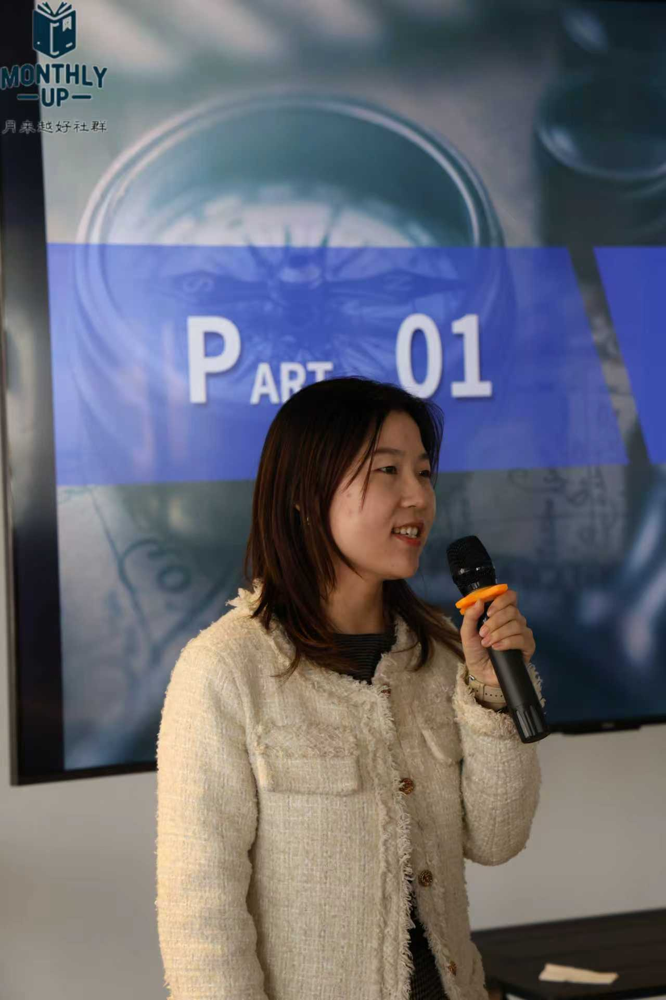

**02 与其预测胜负，不如做个不退赛的“长跑者”**

■ ■ ■ ■

**嘉宾在分享中颠覆了许多人对“投资预测”的执念，提出了“概率思维”与“输家游戏”的核心认知。**

**嘉宾说道：**
投资的第一个核心认知是——这个世界本身就是概率的。宏观、微观、甚至个人的感情因素都在时刻影响着结果。预测是不可靠的。我们不能希望通过对未来的预测来做今天的投资。

既然预测不可靠，那我们的目的到底是什么？是跑完。

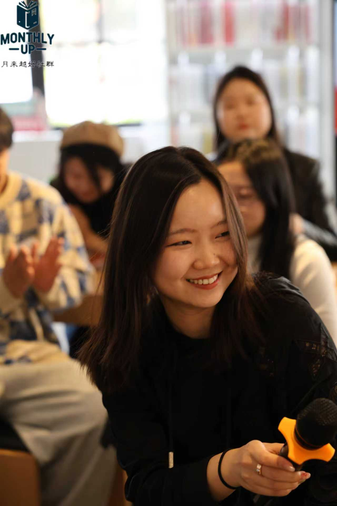

这里涉及到一个概念——**“Loser's Game”（输家的游戏）**。马拉松冠军需要天赋、极度科学的训练与资源的堆砌。但在投资的长跑中，绝大多数人并不具备成为“世界冠军”的资源。

我们要培养的不是如何成为“赢家”，而是如何不沦为“输家”。只要确保不因为激进导致半途退出（Stay in the game），你就已经跑赢了99%的人。这种“不退赛”的定力，比任何短期的超额回报都重要，因为它让你学会了在不确定性中与自己握手言和。

**03 穿透周期的定力：实战价值挖掘与人生节律**

■ ■ ■ ■

**投资的逻辑往往通向实战的取舍，最终汇流向人生的哲学。嘉宾现场分享了他在具体案例中的思考，以及应对高压环境的智慧。**

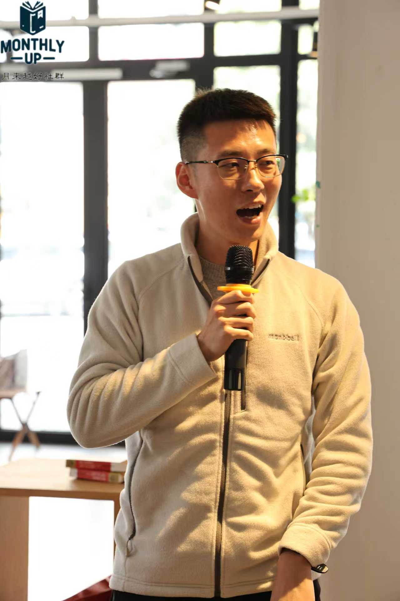

**嘉宾特别分享了两个实战案例：**
一是2022年的数据中心投资，即便在科技风向转变时，也基于数字化大周期的认知坚持推进；二是2023年的某地产项目，即便价格低廉，但因缺乏足够的安全边际（Buffer）而断然放弃。

“在下行周期，你绝不能把自己逼到‘必须每一步都如期发生’的死胡同。保持对市场的敬畏，给自己留一点犯错的空间。”

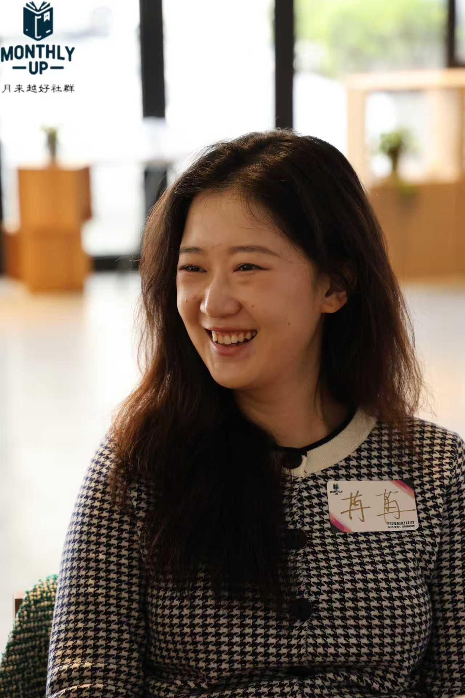

这种定力延伸到生活中，便是对**“节奏”**的把控。嘉宾引用了一战法军总司令霞飞的故事：在巴黎岌岌可危的边缘，霞飞依然坚持准时用餐、准时睡觉。因为他知道，如果自己乱了阵脚，团队也会乱；只有稳定住生活的基准线（Nothing can change），才能在纷乱中做出最理智的决策。

无论是像“狐狸”一样不断根据事实修正观点（Superforecasting），还是在压力下维持跑步与阅读的习惯，本质上都是在修炼一颗 Stay true to yourself 的心。

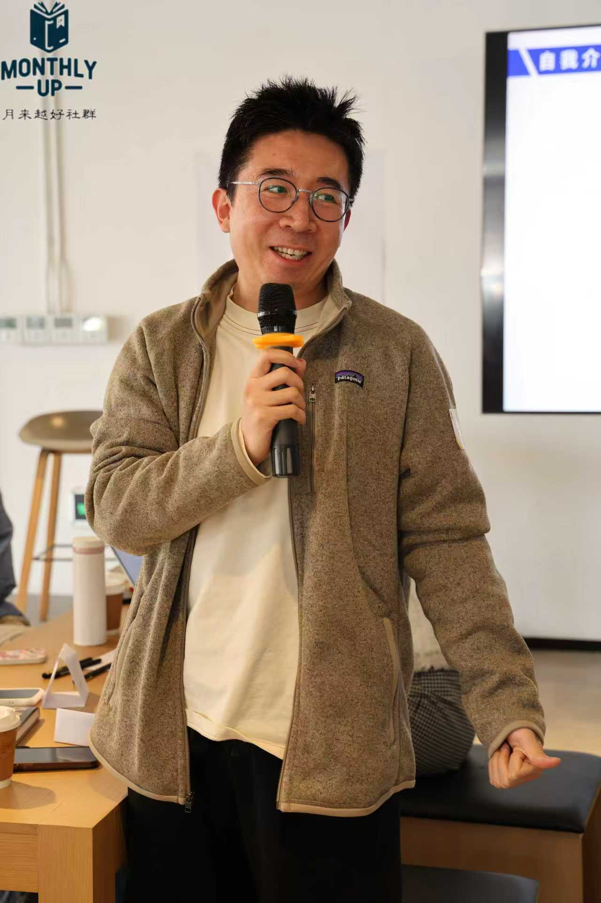

**04 精华问答：在实战中寻找自我与优势**

■ ■ ■ ■

**在提问环节，嘉宾针对社群伙伴们关于自我定位、投资优势及应对危机的困惑进行了深度解答。**

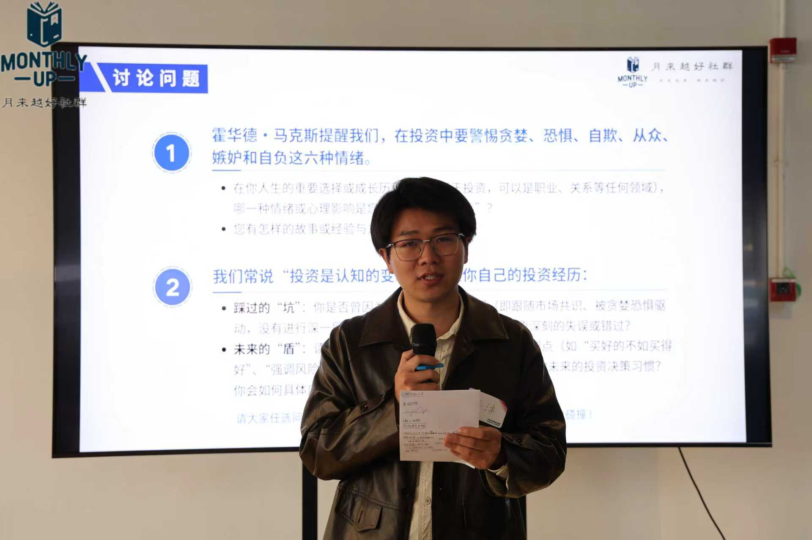

**Q**

**在投资和生活中，如何找到真实的自我？**

**A**

首先要明确自己“不想要”什么，这样才不会被别人的观点轻易左右。对于正确的观点，要敢于接受并放下自尊。学会理解他人的视角，并通过不断的实践尝试，逐步建立属于自己的内核。

**Q**

**在 AI 盛行的时代，个人投资者的优势在哪里？**

**A**

要学会逆向思考。通过深入研究找到市场未被发现的机会，最重要的是控制情绪——当大家都在跟风卖出时，你能否保持冷静？这才是真正的个人竞争优势。

**Q**

**作为职业经理人，如何避免激进的错误决策？**

**A**

很多错误决策源于性格的过度乐观，或是为了获得上级认可而冒险。你要克服“害怕失去”的心理，坚持自己的专业判断，不要为了短期利益影响长期的职业品牌。

**Q**

**AI 对未来的工种有什么具体影响？**

**A**

数据分析、报告撰写这类重复性高且有逻辑可循的工作最容易被 AI 替代。但 AI 也是工具，我最近也在用 AI 生成 PPT 和做 Excel 分析，效率提升巨大。与其担心被替代，不如先学会利用它。

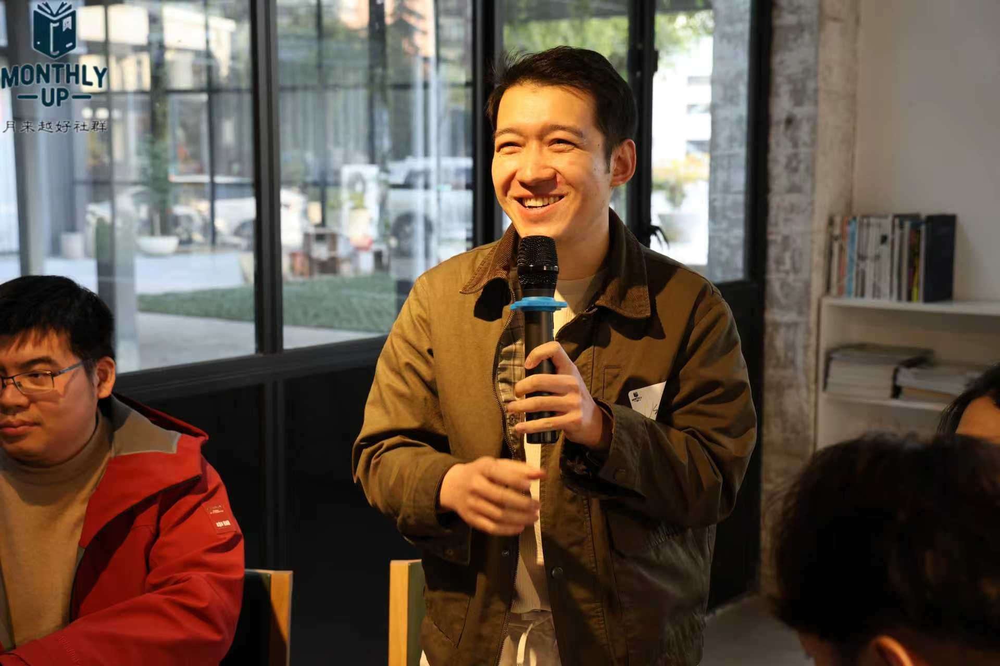

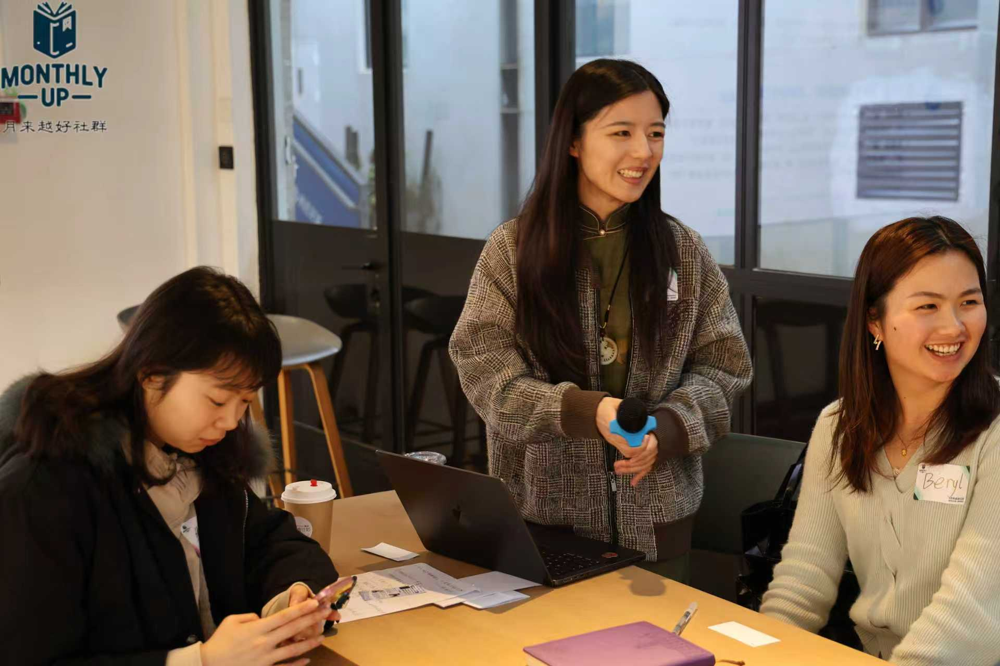

**05 小组讨论的精彩时刻**

■ ■ ■ ■

（内容待填补）
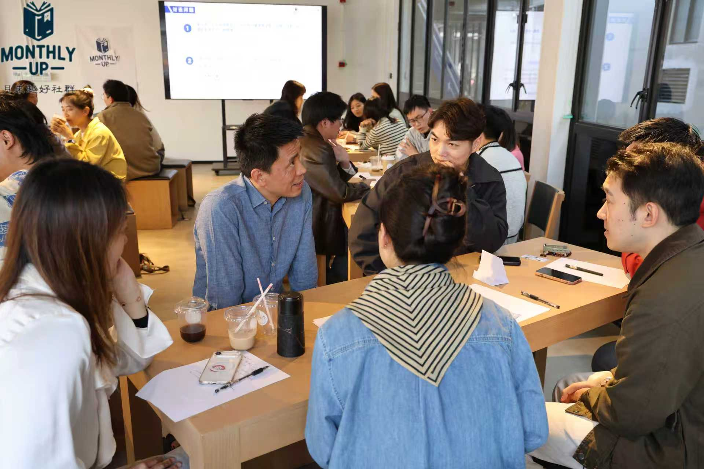

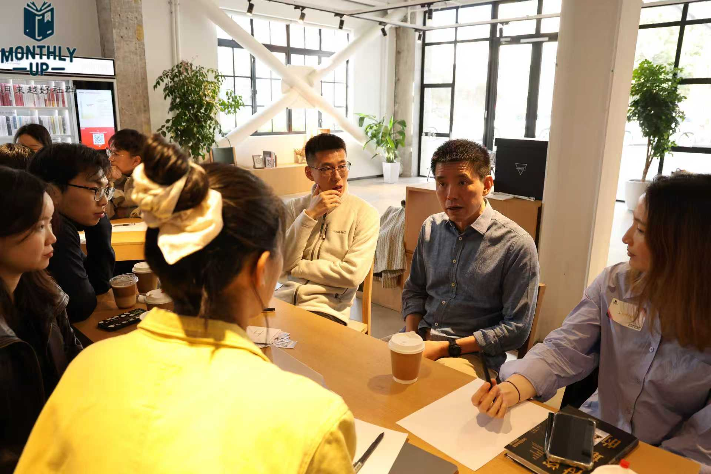

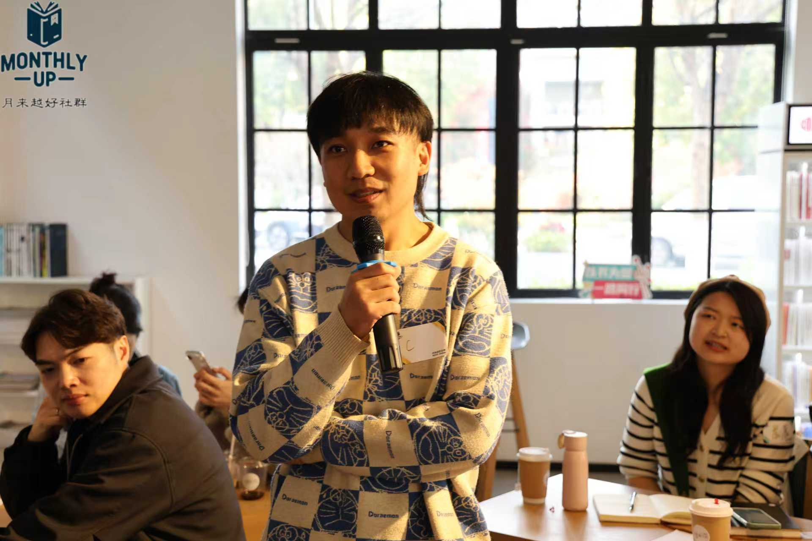

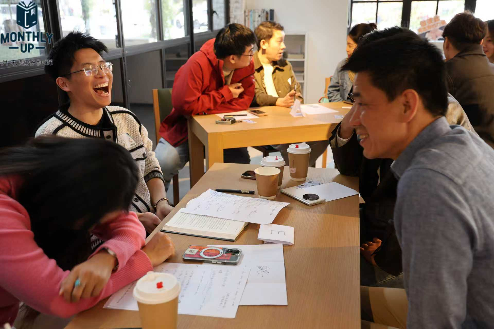

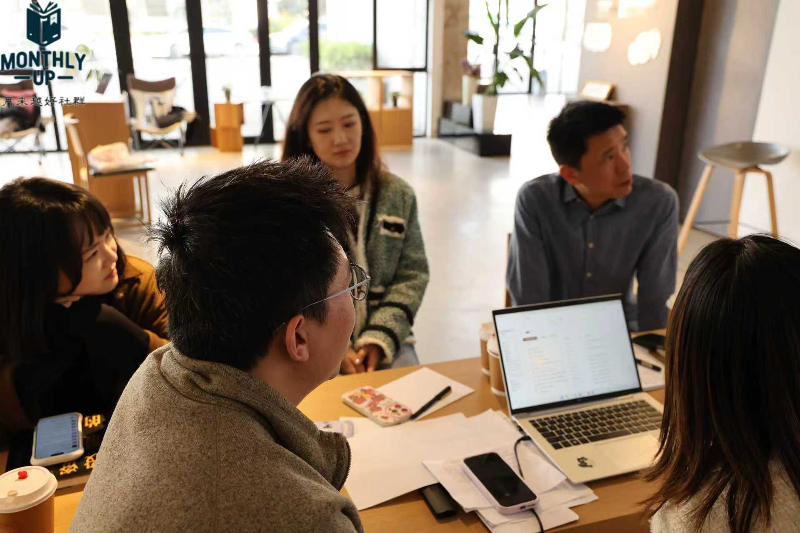

**06 致谢与预告**

■ ■ ■ ■

嘉宾在最后提到了那句令人印象深刻的话：“为了坚持真实，我愿意接受失去（Willing to lose）。”

感谢嘉宾近四个小时的倾囊相授。特别感谢本次活动的两位领读人——阳哥与健哥。两位可谓是将领读深度“卷”出了新高度，不仅拆解透彻，制作的领读卡更是精美别致、赏心悦目，为这次共读增色不少。也由衷感谢每一位认真研读这本投资经典、带着深度思考来到现场的伙伴们。在这个充满变化的世界里，或许我们无法预测未来，但我们可以通过建立稳健的底层认知，在不确定的浪潮中稳住舵盘。

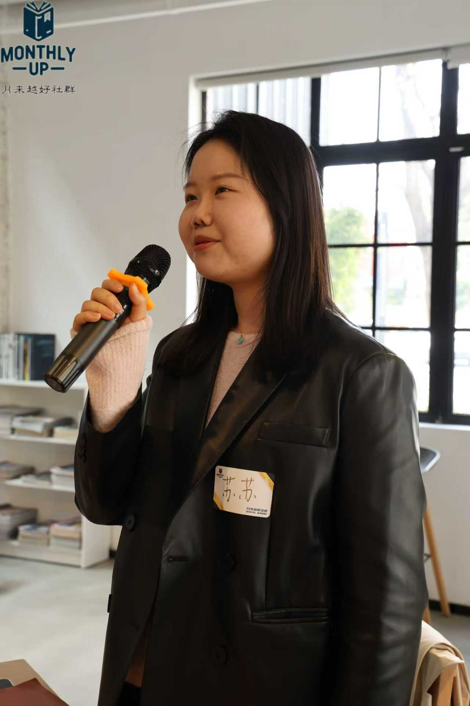

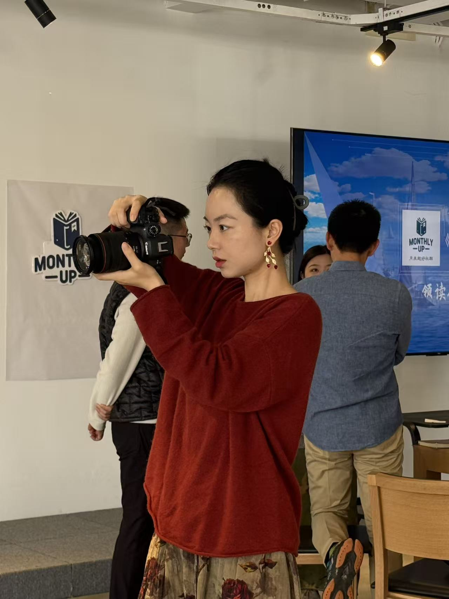

** 【活动预告】↷**

# 月来越好×下一期联名活动报名即将开启！

保持关注，敬请期待！

撰稿：AI助手
摄影：社群伙伴
审核：月来月好编辑部
